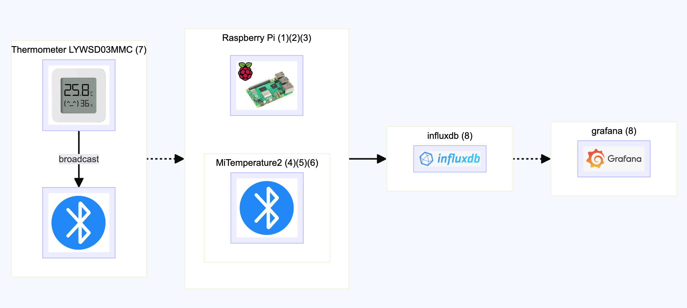

# original repository

```
original 
README_original.md
original
https://github.com/JsBergbau/MiTemperature2
```

<br/>

# about this MiTemperature2

- LYWSD03MMC.sh (it's python program, running on a Raspberry Pi, scan bt signals, send to influxdb)
- config and set up every thermometer (7)
- setting up Raspberry Pi (1)
- install necessary packages (incl. python) (2)
- manually scan bt signals, write down, ready to update to 'devicelistfile_hby' (3) 
- use user account to setup python env and config MiTemperature2 (4)(5)
- run the program LYWSD03MMC.sh (6)




### (1) Raspberry Pi Imager

- https://www.raspberrypi.com/software/operating-systems/
- i use pi3b, 64bit, bullseye, no desktop version (desktop version takes long to 'apt update ...')
- Debian GNU/Linux 11 (bullseye)
- Linux pi3b 6.1.21-v8+ #1642 SMP PREEMPT Mon Apr  3 17:24:16 BST 2023 aarch64 GNU/Linux
- it comes with /usr/bin/python # --version Python 3.9.2

### (2) root
```bash
apt install -y git htop tmux
apt install -y python3 python3-pip python3-venv
apt install -y bluez libbluetooth-dev libglib2.0-dev
apt install -y bluetooth 
```

### (3) root find out Xiaomi Mi Bluetooth MAC
```bash
sudo hcitool lescan
# write down 
```

### (4) user
```bash
mkdir -p $HOME/venv; cd $HOME/venv
/usr/bin/python3.9 -m venv --system-site-packages py39bt
source py39bt/bin/activate
pip3 install --upgrade pip
# use requirements
pip3 install -r py39bt.pi3b.bullseye.requirements.txt
# ( or install by hand)
#pip3 install bluepy
#pip3 install pybluez pycryptodomex
```

### (5) user MiTemperature2
```bash
# under venv 'py39bt'
sudo setcap cap_net_raw,cap_net_admin+eip $(eval readlink -f `which python3`)
cd
git clone https://github.com/jiechau/MiTemperature2.git
cd MiTemperature2
cp devicelistfile_example_hby devicelistfile_hby
vi devicelistfile_hby # the bt address found in (3)
cp config_secrets_example_MiTemperature2.txt config_secrets.txt
vi config_secrets.txt # your secret info about influxdb in (8)
```

### (6) user run
```bash
. LYWSD03MMC.sh
```

<br/><br/>

# misc


### (7) More info about device, Xiaomi Mijia (LYWSD03MMC):
```
sensor firmware update, use the latest version:
https://github.com/pvvx/ATC_MiThermometer 
find correct device, write down the id. connect, activate,
flash custom firmware v4.3
Advertising interval 2.5sec -> 5sec 
Measure interval 4x adv => 8*adv
min LCD refresh rate: 2.45 -> 10 sec
advertising type:  PVVX(custom, temp two digits after dot, also use later MiTemperature2)
```

### (8) influxDB and Grafana

- install influxDB and Grafana, and create db...
- reference: https://simonhearne.com/2020/pi-influx-grafana/

#### influxDB

- i use influxdb 1.x version (not 2.x)
- only need to backup:
    - $HOME/influxdb/data
    - $HOME/influxdb/config/influxdb.conf
- use docker, influxdb:1.8
```bash
docker run -d \
  -p 8086:8086 \
  -v $HOME/influxdb/data:/var/lib/influxdb \
  -v $HOME/influxdb/config/influxdb.conf:/etc/influxdb/influxdb.conf:ro \
  -e INFLUXDB_DB=home \
  -e INFLUXDB_ADMIN_USER=grafana \
  -e INFLUXDB_ADMIN_PASSWORD=grafana \
  -e INFLUXDB_USER=grafana \
  -e INFLUXDB_USER_PASSWORD=grafana \
  --name influxdb_18 \
  influxdb:1.8 -config /etc/influxdb/influxdb.conf
```
- attach to container to create db and user account (for LYWSD03MMC to insert data)
```
influx # cli 
>
create database home
use home
create user grafana with password 'grafana' with all privileges
grant all privileges on home to grafana
show users

user admin
---- -----
grafana true

or
SET PASSWORD FOR "grafana" = 'grafana'
```

- test insert data
```bash
curl -i -XPOST 'http://<ip>:8086/write?db=home' \
--user 'grafana:grafana' \
--data-binary 'sensor_hby,sensorname=HBY_bedroom temperature=25.5,humidity=68,voltage=2.998' 
```

#### Grafana

- i use docker, grafana:10.4.2
- only need to backup:
    - $HOME/grafana/lib
    - $HOME/grafana/etc
```bash
cd $HOME/grafana
chmod -R 777 etc
chmod -R 777 lib
```
```bash
docker run -d \
  --name=grafana_10.4.2 \
  -p 3000:3000 \
  -v $HOME/grafana/lib:/var/lib/grafana \
  -v $HOME/grafana/etc:/etc/grafana \
  grafana/grafana:10.4.2
```

- ui
```
http://<ip>:3000/
```

- test
```
http://<ip>:3000/api/health
```

- establish data connection to inflxdb
    - use port 3000 ui, login in, establish data connection by
    - Home > Connections > Add new connection. Search for 'InfluxDB', then 'Add new data source'
    - fill all necessary fields, incl. Database: home, User:grafana, Password:<pass>
- build a new dashboard from this data source
    - go Grafana public Dashboard library https://grafana.com/grafana/dashboards/
    - search for 'xiaomi', there are some, i use Dashboard ID: 15853 
    - Home > Dashboards > New dashboard, 'Import a dashboard', input the grafana.com ID: 15853 
    - you might need to do some tweak
- this is what you got at last:


- in case you need to reset admin password (default admin/admin), attach to your grafana container, issue cli command:
```bash
grafana-cli admin reset-admin-password admin
```


### Debug:
```bash
./LYWSD03MMC.py -d A4:C1:38:57:38:9F -r -b
./LYWSD03MMC.py -p
curl -i -u "<USERNAME>:<PASSWORD>" -XPOST http://<IP>:<PORT>/write?db=home\&precision=s --data-binary "sensor_hby,sensorname=HBY_livingroom temperature=28.3,humidity=77,voltage=2.95"
```